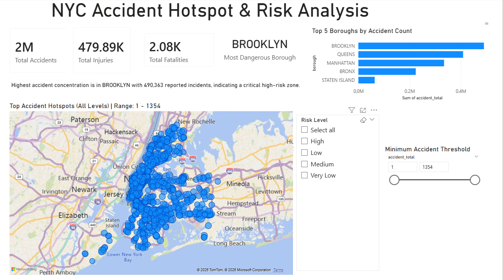

# NYC Accident Hotspot & Risk Analysis

## Overview
This project analyzes NYC accident data using Power BI to identify high-risk zones and patterns across boroughs.

The goal was to transform raw accident data into actionable insights using geospatial analysis and interactive dashboards.

---

## Dashboard Preview

---

## Data Source

The dataset used in this project is publicly available:

[NYC Motor Vehicle Collisions Dataset](https://catalog.data.gov/dataset/motor-vehicle-collisions-crashes)

Due to size constraints, the dataset is not included in this repository.

### Key Fields Used
- latitude, longitude → for hotspot mapping
- borough → regional grouping
- accident_total → accident count
- injuries_total → injury count
- fatalities_total → fatality count

## Key Features
- Geospatial hotspot mapping using latitude and longitude
- Aggregated metrics: total accidents, injuries, and fatalities
- Dynamic filtering by risk level and threshold values
- Top-N analysis to identify highest-risk boroughs
- Automated insight generation using DAX

---

## Tools & Technologies
- Power BI
- DAX
- Data Modeling
- Excel / CSV Data Processing

---

## Key Insights
- Brooklyn has the highest accident concentration (~490K incidents)
- High-risk clusters are concentrated in central NYC regions
- Accident distribution varies significantly across boroughs

---

## How to Use
1. Download the `.pbix` file from the `dashboard/` folder
2. Open using Power BI Desktop
3. Use filters to explore accident hotspots and trends

---

## Project Value
This project demonstrates:
- Data modeling and aggregation
- Geospatial analysis
- Dashboard design for decision-making
- Insight generation using DAX
